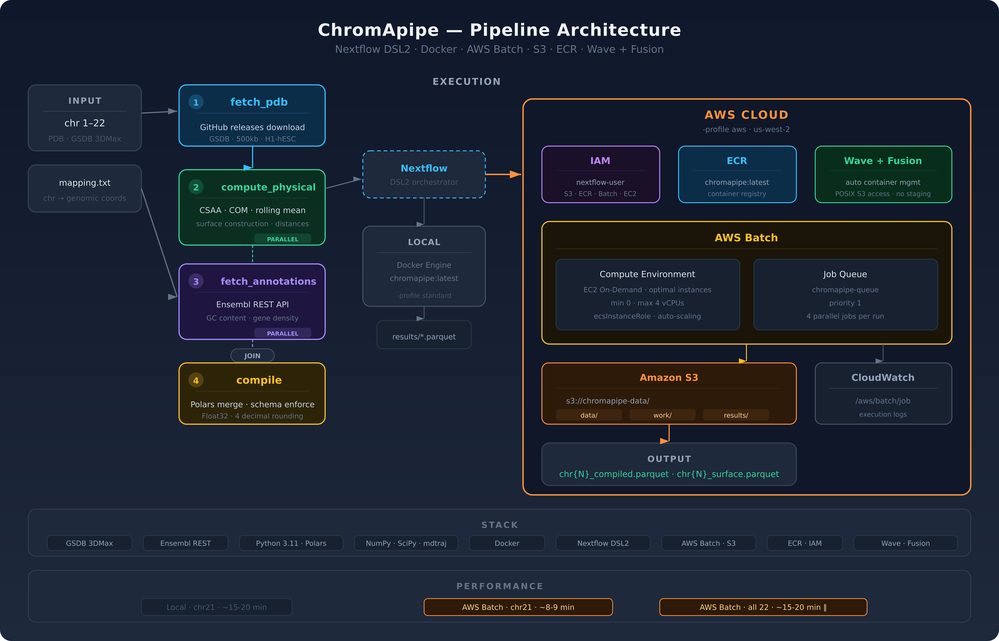

# ChromApipe

[](https://www.nextflow.io/) [](https://www.docker.com/) [](https://aws.amazon.com/batch/) [](https://opensource.org/licenses/MIT)

A containerized Nextflow pipeline that analyzes the relationship between 3D chromosome organization and genomic features. Computes physical properties from reconstructed chromosome structures alongside biological annotations, outputting analysis-ready Parquet files per chromosome.

## About

3D genome organization plays a critical role in gene regulation — structural irregularities are linked to developmental diseases and cancer. This pipeline pulls genomic annotations via REST APIs while deriving physical attributes from 3D chromosome models in parallel.

ChromApipe implements the **Chromosome Accessible Surface Area (CSAA)** algorithm from [GenBrowser](https://github.com/h4rrye/genBrowser), which constructs a surface around the chromosome to quantify open chromatin regions — a computational proxy for transcription factor accessibility, proposed as an alternative to ATAC-Seq.

## Architecture

[](https://github.com/h4rrye/chromApipe/blob/main/docs/img/chromapipe_architecture_aws.png)

**Four pipeline stages run via Nextflow DSL2:**

**fetch_pdb** — Downloads chromosome PDB structures from GSDB GitHub releases.

**compute_physical** — Computes center of mass, rolling mean spline, distance metrics, and the CSAA surface construction using overlapping spheres on a 50³ grid.

**fetch_annotations** — Queries the Ensembl REST API for GC content and gene density per 500kb bin. Runs in parallel with compute_physical.

**compile** — Merges all outputs using Polars with schema enforcement (Float32, 4 decimal rounding). Outputs per-chromosome Parquet files.

## Data Source

3D chromosome structures from the [Genome Structure Database (GSDB)](https://gsdb.mu.hekademeia.org/) — 3DMax reconstructions of H1-hESC (GSE105544), 500kb resolution. Biological annotations from the [Ensembl REST API](https://rest.ensembl.org/).

## Output

Each chromosome produces two files:

**chr{N}_compiled.parquet** — One row per 500kb bin: 3D coordinates (`x`, `y`, `z`), `dist_surface` (CSAA), `dist_com`, `dist_rolling_mean`, genomic coordinates (`start`, `end`), `gc_content`, `gene_density`.

**chr{N}_surface.parquet** — 3D coordinates of the constructed chromosome surface.

## Quick Start

### Local (Docker)

```bash
git clone https://github.com/h4rrye/chromApipe.git
cd chromApipe
docker build -t chromapipe:latest .

# Single chromosome
nextflow run main.nf -profile standard --chromosomes 21

# Multiple chromosomes
nextflow run main.nf -profile standard --chromosomes 1,2,3
```

### AWS Batch

```bash
nextflow run main.nf -profile aws --chromosomes 21

# All 22 autosomes in parallel
nextflow run main.nf -profile aws --chromosomes 1,2,3,4,5,6,7,8,9,10,11,12,13,14,15,16,17,18,19,20,21,22
```

The AWS profile uses Wave containers and Fusion file system for direct S3 access without manual staging.

## Cloud Setup

The pipeline runs on AWS Batch with Nextflow's Wave + Fusion integration:

1. **IAM**: Create `ecsInstanceRole` with EC2, ECS, S3, and SSM policies
2. **S3**: Create a bucket for the work directory and results
3. **Batch**: Create a managed EC2 compute environment (min 0, max 4 vCPUs) and job queue
4. **Config**: Update `nextflow.config` with your bucket name, queue name, and region

Wave handles container distribution automatically — no need to push images to ECR. Fusion provides POSIX-compliant S3 access, eliminating the need for AWS CLI inside containers.

## Parameters

```bash
--chromosomes 1,2,3,21    # Comma-separated chromosome numbers (default: all 22)
--outdir results           # Output directory or S3 path
--mapping data/mapping.txt # Chromosome-to-genome coordinate mapping
```

## Stack

**Pipeline:** Nextflow (DSL2), Docker, AWS Batch, Wave Containers, Fusion File System

**Processing:** Python 3.11, Polars, NumPy, SciPy, mdtraj, Pandas, PyArrow

**APIs:** GSDB (3D structures), Ensembl REST API (genomic annotations)

**Cloud:** AWS Batch, S3, EC2, IAM, CloudWatch

## Performance

|                    | Local (Docker) | AWS Batch             |
| ------------------ | -------------- | --------------------- |
| Single chromosome  | ~15-20 min     | ~8-9 min              |
| All 22 chromosomes | Sequential     | ~15-20 min (parallel) |

## Future Scope

- Gene expression integration (H1-hESC RNA-seq from ENCODE)
- Histone modification and replication timing annotations
- Network analysis using NetworkX for chromatin interaction topology
- nf-core compatibility

## License

MIT
